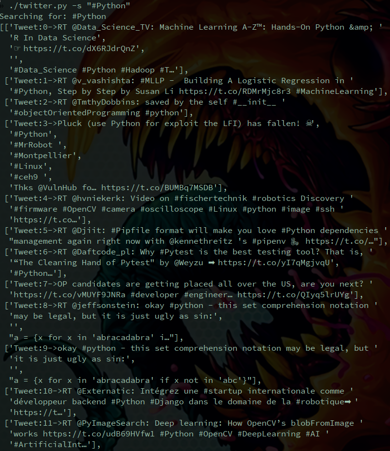

# Twitter CLI Client

### Tweet, Search or Stream from your command line

This script basically encapsulates what the wonderful library of [Twython](https://github.com/ryanmcgrath/twython) can do, so big props to the creator.

## Screenshots

1. Tweeting

2. Searching

3. Streaming

---

# Installation:

1. Clone the repository to your local machine
2. Create an application so you can obtain your api keys and authentication keys on [Apps Twitter](https://apps.twitter.com/)
3. Modify the `twitterConfig.yaml` file with your appropriate keys. File found inside your cloned repo.

       --- # Twitter API Credentials
       Twitter_API:
           CONSUMER_KEY: 'YOUR KEY GOES HERE'
           CONSUMER_SECRET: 'YOUR KEY GOES HERE'
           AUTH_TOKEN: 'YOUR KEY GOES HERE'
           AUTH_SECRET: 'YOUR KEY GOES HERE'

4. Add execution permission to the script

       chmod +x twitter_cli.py

5. Familiarize yourself with the script options by running:

       ./twitter.py -h
       
6. Additionally you can install it locally if you want to play around with it by doing:

       pip install -e .

> It will use the `setup.py` file to install it locally so you can simply type `twcli` to get the same results.

Once installed....

> It should display:

        usage: twitter.py [-h] [-u UPDATE] [-s SEARCH] [-t STREAM]

        Twitter CLI Client: 2.0

        optional arguments:
          -h, --help  show this help message and exit
          -u UPDATE   Tweet something
          -s SEARCH   Search for tweets
          -t STREAM   Start the streaming process

---

# Usage:

### To tweet - Run:

        ./twitter.py -u "Your tweet here"
        
        twcli -u "Your tweet here"

### To search - Run:

        ./twitter.py -s "Your search string"

        twcli -u "Your Tweet here"

### To start the stream - Run:

        ./twitter.py -t "Your stream item"
       
        twcli -t "Your stream item"

---

# TODO:

* TODO: Add options to tweet with media
* TODO: Put stream class on a separate file
* TODO: Create this as a subprocess so it doesn't stop the application.
* TODO Add options to save to file in parser
